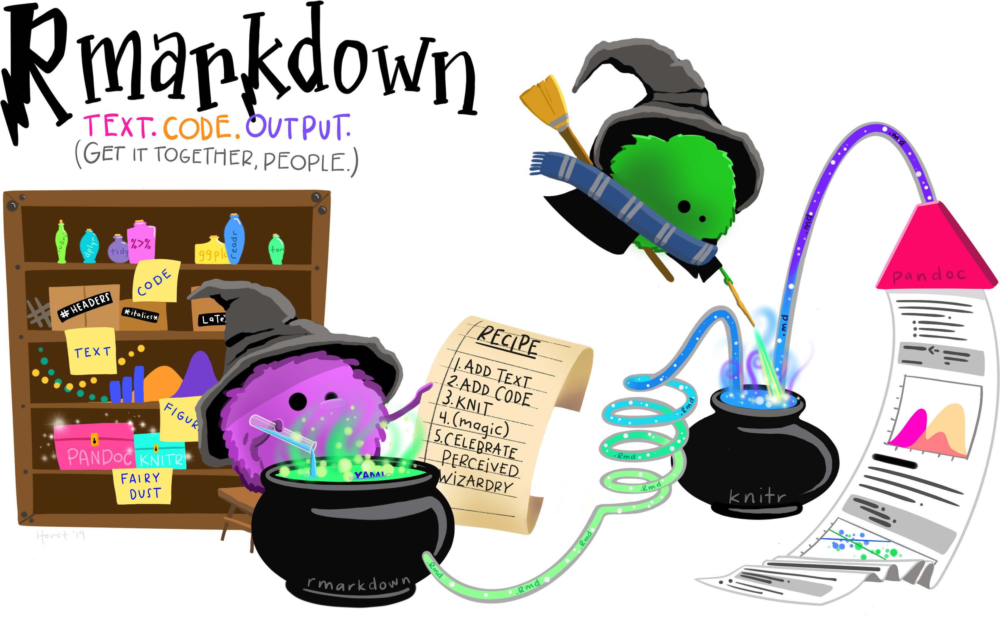

```{r xaringan-tachyons, echo=FALSE}
xaringanExtra::use_tachyons()
xaringanExtra::use_tile_view()
xaringanExtra::use_panelset()
xaringanExtra::use_freezeframe(responsive = FALSE)

# will be used several times in a cat engine
temp_file <- tempfile()
# setting option for the several cat engine
knitr::opts_template$set(cat_md = list(
  engine.opts = list(file = temp_file, lang = "markdown"),
  echo = TRUE
))
# clean tempfile after a chunk computation
knitr::knit_hooks$set(rm_temp = function(before) {
  if (!before) unlink(temp_file)
})
```

# About me

.center[

.profile[]

RStudio &#8226; Software Engineer &#8226; R Markdown Team

]
.pull-left[
.center[
`r fontawesome::fa("github")`
[@cderv](https://github.com/cderv)
]
]

.pull-right[
.center[
`r fontawesome::fa("twitter")`
[@chrisderv](https://twitter.com/chrisderv)
]
]

???

---
# What is this talk about ? 

.pull-left.center[

.f6[https://pkgs.rstudio.com/rmarkdown/]
]
.pull-right.center[

.f6[https://bookdown.org/yihui/rmarkdown-cookbook/]
]

???

Everyone should know rmarkdown among R users. Its principle has not changed since a long time 
(md + R = Rmd -> output format) quite easy to start (write text, add code chunk, compile) but it can be harder to learn new skill to be more efficient and get full power. 

That is where known recipes can help master more advanced skills. R Markdown Cookbook was thought as a non linear documentation

---
layout: true

# What happens when it renders ?

---

.center[]
.source-fig.center[Source: https://github.com/allisonhorst/stats-illustrations]

???

We often see these rmarkdown little wizard mixing Text & Code to produce document. Aim is to look deeper into this today. This is not so magic.

---

.box.f3[`knitr::knit()` + Pandoc (+ LaTeX for PDF) = `rmarkdown::render()`]

.center[]
.source-fig.center[
source: [R Markdown Cookbook](https://bookdown.org/yihui/rmarkdown-cookbook)
]


???

This is important to know so that one understand what to tweak to make something works

---
layout: true
# A simple default report

---

.center[


.source-fig.right[
Source file link
]

]

---

.center[


.source-fig.right[
Source file link
]
]

---
layout: false

# Do not show source code block 

.subtitle[knitr options `echo` and `include`]

````markdown
```{r setup, include=FALSE}`r ''`
# do not show code by default
knitr::opts_chunk$set(echo = FALSE)
```
````
* Chunk will be evaluated but no output or source included.
* Do not show the source chunk as code block. Set globally here

---
layout: true
# Add alternative text

.subtitle[About `fig.alt` chunk option]

---

Can be used with an external image

````markdown
```{r species-img, fig.alt = "Illustration of pinguins species : Chinstrap, Gentoo and Adélia", out.width='60%', fig.align = 'center', echo = FALSE}`r ''`
knitr::include_graphics("https://allisonhorst.github.io/palmerpenguins/reference/
figures/lter_penguins.png")
```
````
---

Or with R graphics

````markdown
```{r, include = FALSE}`r ''`
island_repart_alt <- "Horizontal bar chart, faceted by Species showing the number of penguins living on each island, Torgersen, Dream and Biscoe. Adelie lives on the three, whereas Gentoo on Biscoe and Chinstrap on Dream."
```

*```{r island-repart, fig.alt= island_repart_alt}`r ''`
ggplot(penguins, aes(x = island, fill = species)) +
  geom_bar(alpha = 0.8) +
  scale_fill_manual(values = c("darkorange","purple","cyan4"),
                    guide = FALSE) +
  theme_minimal() +
  facet_wrap(~species, ncol = 1) +
  coord_flip()
```
````

---
layout: true
# Style the output (1)

.subtitle[About the `css` engine]

---

````markdown
```{css, echo = FALSE}`r ''`
/* header in blue */
h1, h2, h3 {
  color: #0A7FB2
}
```
````

Applied directly in the Rmd document without an external css file. 

???

Useful with few CSS like with examples or prototyping for instance.
echo = false is important if you don't want to show CSS source chunk in output


---

Using external file : 

````yaml
output:
  html_document:
    css: mystyle.css
````

Better suited to share style across documents.

???

---
layout: true
# Highlight results

.subtitle[Using Custom Blocks]

---

This is powered by [Pandoc's Fenced Divs](https://pandoc.org/MANUAL.html#divs-and-spans) syntax:

```{cat, opts.label ='cat_md'}
::: {.highlight-box style="text-align: center;font-size: 1.5em;"}
The **`r heaviest_specie`** specie is heavier than other ! 
:::
```

---

```{r demo-box, echo = FALSE, results='asis', rm_temp = TRUE}
o <- tempfile()
rmarkdown::pandoc_convert(temp_file, to = "html", output = I(o))
content <- xfun::read_utf8(o)
unlink(o)
```

This will be rendered in HTML

```{cat, engine.opts = list(lang = "html"), code = content}
```

---
layout: true
# Style the output (2)

---

.subtitle[How to improve our highlighted results ?]


> I want to .color1[**add a border**] to create a box and .color1[**apply my blue color**].

Can I use variable for color and limit duplication ? 

---

.subtitle[Using SASS]

.center[]

Sass (https://sass-lang.com) is a CSS extension language that allows you to create CSS rules in much more flexible ways than you would do with plain CSS.

???

It allows for variables, tweaking functions (called _mixins_), operations (like `/`), better CSS rule organisation (nesting, extensions, ...) and more.

---

.subtitle[Using SASS... from R]

.center[

</br>.f3[https://rstudio.github.io/sass/]
]

.box[Support is now built-in **rmarkdown**]

---

.subtitle[Using `sass` / `scss` knitr's engine]

.panelset[

.panel[.panel-name[css]

````markdown
```{css, echo = FALSE}`r ''`
* h1, h2, h3 {color: #0A7FB2;}

div.highlight-box {
* border-color: #0A7FB2;
  border-style: solid;
  padding: 0.5em;
}

div.highlight-box strong {
* color: #0A7FB2;
}
```
````

]

.panel[.panel-name[scss]
````markdown
```{scss, echo = FALSE}`r ''`
*$color1: #0A7FB2; /* using a variable */

*h1, h2, h3 {color: $color1;}

div { /* using nested organization */
  &.highlight-box { 
*   border-color: $color1;
    border-style: solid;
    padding: 0.5em;

    strong {
*     color: $color1;
    }
  }
}
```
````

]
.panel[.panel-name[sass]

````markdown
```{sass, echo = FALSE}`r ''`
$color1: #0A7FB2

h1, h2, h3
  color: $color1

div
  &.highlight-box
    border-color: $color1
    border-style: solid
    padding: 0.5em
  
    strong
      color: $color1
```
````

]
]

???

_sass_ syntax is shorter (no `;` and `{ }`) but more different from _css_ than _scss_, so less easy to get started.

In this example and the previous _scss_ one, we are using special _SASS_ features like [Nesting](https://sass-lang.com/documentation/style-rules/declarations#nesting) and [Parent Selector](https://sass-lang.com/documentation/style-rules/parent-selector).

This allows organization of CSS rules for easier reading and modifications. 


---
layout: false

# A enhanced report


.source-fig.left[
Source file link
]

---

# How to go further ?

.subtitle[and enhanced even more your Rmd !]

.pull-left[
.center[

]
]

.pull-right[

More in the book !

.f5[https://bookdown.org/yihui/rmarkdown-cookbook/]
]

---
class: center, middle, annexe
count: false

# Thank you !

---
class: annexe
count: false

# Acknowledgement

```{r, include = FALSE}
gh_handle_to_link <- function(handle) sprintf("[@%s](https://github.com/%s)", handle, handle)
```


* Emily Riederer and Yihui Xie, for the R Markdown Cookbook
* Allison Horst for the illustrations.
* Alison Presman-Hill and Allison Horst for the **palmerpinguins** `r emo::ji("package")` and vignettes.
* `r gh_handle_to_link("cpsievert")` for the [**sass**](https://rstudio.github.io/sass/) `r emo::ji("package")`
